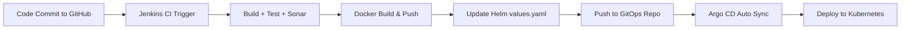

# Jenkins Pipeline for Java based application using Maven, SonarQube, Argo CD, Helm and Kubernetes


flowchart TD
    A[Developer pushes code] --> B[GitHub]
    B --> C[Jenkins Trigger via Webhook]
    C --> D[Build App + Run Tests]
    D --> E[SonarQube Code Analysis]
    E --> F[Docker Build & Push → Docker Hub]
    F --> G[Update Helm values.yaml in repo-manifest]
    G --> H[Git Push → Manifest Repo]
    H --> I[ArgoCD Detects Change]
    I --> J[Auto Sync to K8s]
    J --> K[App Deployed 🎯]


Here are the step-by-step details to set up an end-to-end Jenkins pipeline for a Java application using SonarQube, Argo CD, Helm, and Kubernetes:

Prerequisites:

   -  Java application code hosted on a Git repository
   -   Jenkins server
   -  Kubernetes cluster
   -  Helm package manager
   -  Argo CD

Steps:

    1. Install the necessary Jenkins plugins:
       1.1 Git plugin
       1.2 Maven Integration plugin
       1.3 Pipeline plugin
       1.4 Kubernetes Continuous Deploy plugin

    2. Create a new Jenkins pipeline:
       2.1 In Jenkins, create a new pipeline job and configure it with the Git repository URL for the Java application.
       2.2 Add a Jenkinsfile to the Git repository to define the pipeline stages.

    3. Define the pipeline stages:
        Stage 1: Checkout the source code from Git.
        Stage 2: Build the Java application using Maven.
        Stage 3: Run unit tests using JUnit and Mockito.
        Stage 4: Run SonarQube analysis to check the code quality.
        Stage 5: Package the application into a JAR file.
        Stage 6: Deploy the application to a test environment using Helm.
        Stage 7: Run user acceptance tests on the deployed application.
        Stage 8: Promote the application to a production environment using Argo CD.

    4. Configure Jenkins pipeline stages:
        Stage 1: Use the Git plugin to check out the source code from the Git repository.
        Stage 2: Use the Maven Integration plugin to build the Java application.
        Stage 3: Use the JUnit and Mockito plugins to run unit tests.
        Stage 4: Use the SonarQube plugin to analyze the code quality of the Java application.
        Stage 5: Use the Maven Integration plugin to package the application into a JAR file.
        Stage 6: Use the Kubernetes Continuous Deploy plugin to deploy the application to a test environment using Helm.
        Stage 7: Use a testing framework like Selenium to run user acceptance tests on the deployed application.
        Stage 8: Use Argo CD to promote the application to a production environment.

    5. Set up Argo CD:
        Install Argo CD on the Kubernetes cluster.
        Set up a Git repository for Argo CD to track the changes in the Helm charts and Kubernetes manifests.
        Create a Helm chart for the Java application that includes the Kubernetes manifests and Helm values.
        Add the Helm chart to the Git repository that Argo CD is tracking.

    6. Configure Jenkins pipeline to integrate with Argo CD:
       6.1 Add the Argo CD API token to Jenkins credentials.
       6.2 Update the Jenkins pipeline to include the Argo CD deployment stage.

    7. Run the Jenkins pipeline:
       7.1 Trigger the Jenkins pipeline to start the CI/CD process for the Java application.
       7.2 Monitor the pipeline stages and fix any issues that arise.

This end-to-end Jenkins pipeline will automate the entire CI/CD process for a Java application, from code checkout to production deployment, using popular tools like SonarQube, Argo CD, Helm, and Kubernetes.

Here’s your **end-to-end Jenkins CI/CD pipeline setup** for a Java application using **SonarQube, Argo CD, Helm, and Kubernetes**, rewritten in a **visually attractive, high-contrast, and concise format** — ideal for quick reference or presentations:

---

## 🎯 **Complete CI/CD Pipeline Using Jenkins + Helm + Argo CD**

---

### ✅ **📦 Prerequisites**

| Component              | Status/Tool Used   |
| ---------------------- | ------------------ |
| Source Code Repository | GitHub / GitLab    |
| CI Tool                | Jenkins            |
| Build Tool             | Maven              |
| Code Quality           | SonarQube          |
| Package Manager        | Helm               |
| Deployment Platform    | Kubernetes Cluster |
| GitOps/CD Tool         | Argo CD            |

---

### ⚙️ **🔧 Step-by-Step Pipeline Setup**

---

### 🔌 **1. Jenkins Plugin Installation**

```yaml
- Git Plugin
- Maven Integration
- Pipeline Plugin
- Kubernetes Continuous Deploy
```

---

### 🛠️ **2. Create Jenkins Pipeline Job**

```plaintext
➤ Job Type: Pipeline
➤ Source: Git SCM
➤ Repository: [Your Java App Git URL]
➤ Branch: main / master
```

✅ **Include a `Jenkinsfile`** in the root of the repo.

---

### 📋 **3. Define Pipeline Stages in Jenkinsfile**

```groovy
pipeline {
  agent any

  tools {
    maven 'Maven 3'
    jdk 'OpenJDK 11'
  }

  environment {
    IMAGE_TAG = "appv1.${BUILD_NUMBER}"
    REGISTRY = "docker.io/your-user"
    SONARQUBE_ENV = "SonarQubeServer"
  }

  stages {
    stage('Checkout') {
      steps {
        git url: 'https://github.com/org/java-app.git'
      }
    }

    stage('Build') {
      steps {
        sh 'mvn clean compile'
      }
    }

    stage('Test') {
      steps {
        sh 'mvn test'
      }
    }

    stage('Code Quality - SonarQube') {
      steps {
        withSonarQubeEnv("${SONARQUBE_ENV}") {
          sh 'mvn sonar:sonar'
        }
      }
    }

    stage('Package JAR') {
      steps {
        sh 'mvn package'
      }
    }

    stage('Docker Build & Push') {
      steps {
        sh '''
          docker build -t $REGISTRY/java-app:$IMAGE_TAG .
          echo $DOCKER_PASS | docker login -u $DOCKER_USER --password-stdin
          docker push $REGISTRY/java-app:$IMAGE_TAG
        '''
      }
    }

    stage('Deploy to Test (Helm)') {
      steps {
        sh '''
          helm upgrade --install java-app ./helm-chart \
          --set image.repository=$REGISTRY/java-app \
          --set image.tag=$IMAGE_TAG \
          --namespace=test
        '''
      }
    }

    stage('Acceptance Tests') {
      steps {
        sh './run-acceptance-tests.sh'
      }
    }

    stage('Promote to Prod (Argo CD)') {
      steps {
        withCredentials([string(credentialsId: 'ARGOCD_TOKEN', variable: 'ARGOCD_AUTH')]) {
          sh '''
            curl -H "Authorization: Bearer $ARGOCD_AUTH" \
            -X POST https://argocd.company.com/api/v1/applications/java-app/sync
          '''
        }
      }
    }
  }

  post {
    failure {
      mail to: 'dev-team@company.com',
           subject: "🔴 Jenkins Build Failed - ${env.JOB_NAME}",
           body: "View logs: ${env.BUILD_URL}"
    }
  }
}
```

---

### 🧱 **4. Helm Chart Folder Structure (repo-manifests)**

```plaintext
helm-chart/
├── Chart.yaml
├── values.yaml
└── templates/
    ├── deployment.yaml
    ├── service.yaml
    └── ingress.yaml
```

---

### 🚀 **5. Argo CD Setup**

| Config Area     | Details                                   |
| --------------- | ----------------------------------------- |
| Install Argo CD | On Kubernetes Cluster                     |
| GitOps Repo     | Point to `repo-manifests` with Helm chart |
| Auto Sync       | ✅ Enabled                                 |
| Auth            | API token for Jenkins via Argo CD UI/API  |

---

### 🔄 **6. GitOps Flow with ArgoCD**



---

### 📬 **7. Notifications (Failure Case)**

```yaml
Tool: Jenkins Email Extension Plugin
Action: Send email on any stage failure
To: dev-team@company.com
```

---

### 🎉 **Outcome: Fully Automated CI/CD Pipeline**

> ☑️ CI with Maven, Sonar, Docker
> ☑️ CD with Helm & ArgoCD
> ☑️ GitOps-driven rollout to Kubernetes
> ☑️ End-to-End Testing & Notification

---

Would you like this exported as a **PDF**, **PowerPoint**, or **Markdown guide** for distribution or training use?

